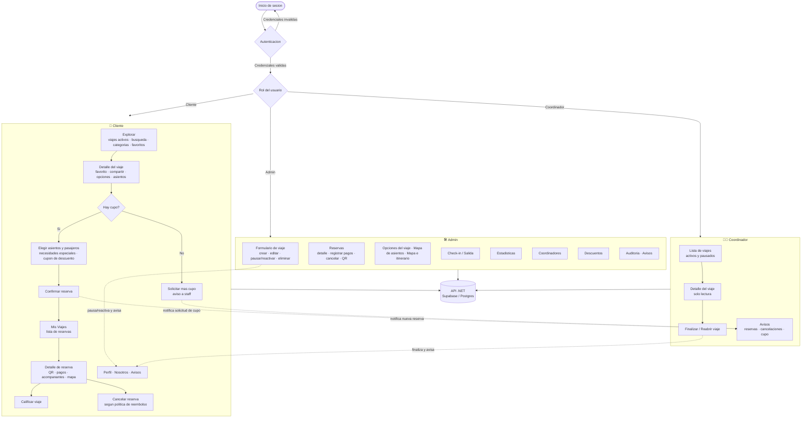

# Diagrama de flujo — TravelAgency

Flujo de la app por roles: **Cliente**, **Coordinador** y **Admin**.

> Este bloque Mermaid se puede pegar directo en cualquier visor Markdown y también
> importar en Excalidraw (menú **More tools → Mermaid to Excalidraw**).

## Notas de roles

| Rol | Puede | No puede |
| --- | --- | --- |
| **Cliente** | Explorar, reservar, pagar/abonar, cancelar (con politica), calificar, favoritos, perfil, avisos | Administrar viajes, ver otros clientes, gestionar descuentos |
| **Coordinador** | Ver viajes y su detalle, finalizar/reabrir, recibir avisos | Crear/editar/eliminar viajes, registrar pagos, check-in, auditoria, descuentos, coordinadores |
| **Admin** | Todo: viajes (crear/editar/pausar/reactivar/eliminar), reservas y pagos, opciones, asientos, mapa, check-in, estadisticas, coordinadores, descuentos, auditoria | — |

## Flujos de notificacion (panel Avisos)

- **Cliente → staff:** nueva reserva, solicitud de cupo, necesidades especiales.
- **Staff → cliente:** pago recibido / reserva liquidada, viaje finalizado (calificar),
  cancelacion, viaje pausado o reactivado.

## Importar en Excalidraw

1. Copia el bloque Mermaid de arriba.
2. En Excalidraw: **More tools → Mermaid to Excalidraw**, pega y genera.
3. Alternativa: importa `docs/flujo-app.excalidraw` (archivo nativo).
